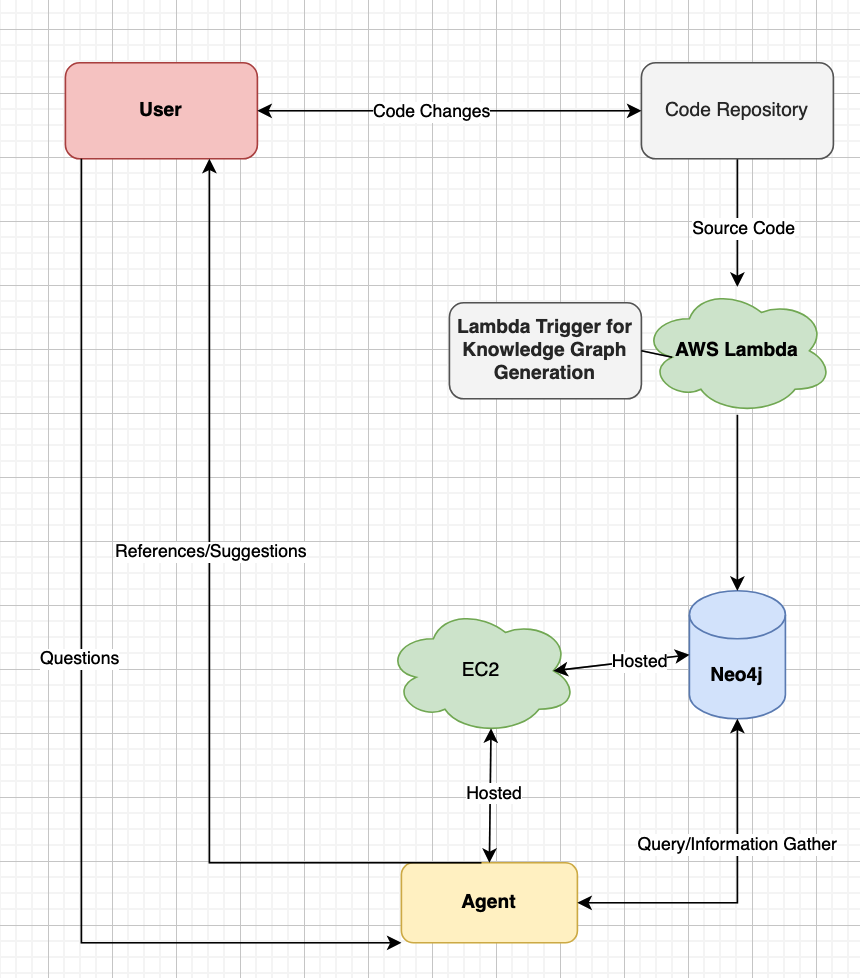

CodeContext: AI-powered suggestions and edits for code base

Overview: CodeContext is an AI-driven tool that offers intelligent code suggestions and automated edits based on the analysis of your codebase. By understanding the structure and semantics of the code, it can recommend improvements, detect errors, and even provide refactoring suggestions in real time. With its powerful integration into development environments, CodeContext serves as a code assistant, improving developer productivity and code quality.

Generating a Knowledge Tree from Codebase AST:

A knowledge tree is a structured representation of the underlying relationships and structures in a codebase. One way to generate a knowledge tree is by parsing the Abstract Syntax Tree (AST) of the code.

The AST is a hierarchical tree structure that represents the syntax of the source code, breaking down the program into nodes that represent various components like functions, classes, variables, and control structures.

Here’s a breakdown of how the process works:

    Parsing the Codebase:
        The first step is to parse the codebase using a tool or library that generates the AST. This is done by analyzing the source code and converting it into a structured format that breaks down the code into logical components (e.g., statements, expressions, functions).
    Creating the Knowledge Tree:
        Once the AST is generated, a knowledge tree can be created by extracting key entities such as:
            Functions and Methods: Identifying the scope of each function, its parameters, and its relationships to other functions.
            Classes and Modules: Mapping out the classes, their inheritance relationships, methods, and variables.
            Control Flow Constructs: Tracking loops, conditionals, and branching structures to understand the flow of logic in the program.
            Variables and Data Types: Understanding where variables are defined and how they’re used throughout the codebase, including their types and scope.
    Building Relationships:
        The knowledge tree connects these components to illustrate dependencies, relationships, and interactions between them. For example:
            How functions call each other.
            How variables are used across different functions or classes.
            How data flows through various parts of the codebase.
    AI-Powered Suggestions and Edits:
        By analyzing this knowledge tree, CodeContext’s AI can make informed suggestions about code optimizations, bug fixes, or refactoring opportunities. For instance:
            Refactoring: If the AI identifies a function with high complexity or repeated code, it might suggest refactoring opportunities.
            Bug Detection: The AI can spot potential issues such as variable misuse or unreachable code by traversing the tree’s relationships.
            Code Completion and Enhancement: Based on the understanding of function dependencies, the AI can suggest autocompletions for variables, methods, and class names, improving developer speed and reducing errors.

Benefits:

    Improved Code Understanding: Developers gain insights into the code’s structure, making it easier to maintain and expand.
    Context-Aware Suggestions: The AI doesn’t just make generic suggestions; it tailors recommendations based on the exact structure and relationships in the code.
    Refactoring and Optimization: CodeContext identifies areas where the code can be refactored or optimized, improving both readability and performance.

Example: Imagine a codebase with several classes and methods. By parsing the AST, CodeContext can identify that two methods are closely related or that a method is overly complex. It could then recommend splitting the method, simplifying it, or changing the parameters to reduce coupling with other parts of the codebase.

Parsing Supported Languages:  (in progress: )

System Design:

